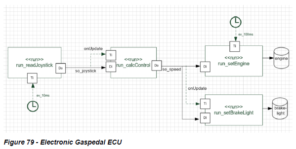

# Electronic_Gas_Pedal
An Autosar-based electronic gas pedal ECU that reads joystick input and controls engine speed and brake light via RTE-managed communication.

# Requirements

| Req-Id | Description                                                                                                                                                                    |
| ------ | ------------------------------------------------------------------------------------------------------------------------------------------------------------------------------ |
| NFR1   | The ECU shall be developed using the Autosar RTE architecture on Erika OS, separating Application Software (ASW) and Basic Software (BSW).                                     |
| FR1    | The runnable `run_readJoystick` shall be executed cyclically every 10 ms and update the joystick signal using `pullPort()`.                                                    |
| FR2    | When the joystick signal is updated, an event shall trigger `run_calcControl`.                                                                                                 |
| FR3    | `run_calcControl` shall calculate the speed signal as follows: if joystick value > 0 → speed = 2 × joystick value; otherwise speed = 0.                                        |
| FR4    | When the speed signal is updated, the runnable `run_setBrakeLight` shall be triggered.                                                                                         |
| FR5    | `run_setEngine` shall be executed cyclically every 100 ms and copy the speed signal to the engine signal if the data is not too old; otherwise engine value shall be set to 0. |
| FR6    | `run_setEngine` shall send the engine signal to the hardware using `pushPort()`.                                                                                               |
| FR7    | `run_setBrakeLight` shall turn the brake light ON if speed = 0, and OFF if speed > 0, and send the signal to the hardware.                                                     |
| NFR2   | Runnables shall communicate only via RTE signal objects. Direct driver or OS calls are not allowed.                                                                            |
| NFR3   | The RTE shall manage cyclic and data-triggered events for runnable activation.                                                                                                 |
| NFR4   | The system shall monitor signal age and signal status for error handling.                                                                                                      |
| NFR5   | Driver functions `pushPort()` and `pullPort()` shall return error codes that must be handled by the application.                                                               |

